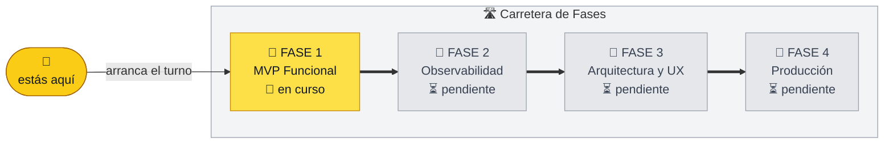

# 🚕 TaxiTech — Taxímetro Digital

> **Taximetro app de 0 a 100.** De la terminal a la flota: un taxímetro 100 % software,
> céntimo a céntimo, construido con DDD en un monorepo uv.


[](https://ia-p1-bcn.github.io/proyecto_1_juanCarlos_escamilla/)


[](https://github.com/astral-sh/ruff)
[](LICENSE)

## 🎬 Demo

> 🎬 **Demo en vídeo — próximamente.** Preparamos una demo del CLI grabada con
> [castkit](https://github.com/deeflect/castkit): descubre el binario, planifica la
> sesión y renderiza un GIF listo para este README.

<!-- Embed real — descomentar al generar el GIF con castkit:


Para regenerarla:
    castkit handoff init apps/cli --json
    castkit plan scaffold --session $SESSION --json
    castkit validate --session $SESSION --script demo.json --json
    castkit execute --session $SESSION --script demo.json --non-interactive \
      --preset polished --format gif --output docs/assets/demo-taximetro.gif
-->

## ✨ Características

- ⌨️ **CLI en tiempo real** — inicia la Carrera con un comando, cambia entre `parada` y
  `en_movimiento`, cobra el Importe exacto con dos decimales *(Fase 1 — 🔧 en desarrollo)*
- 🧾 **Histórico y observabilidad** — cada carrera queda registrada en disco; logs
  estructurados; tarifas configurables sin redeployar *(Fase 2)*
- 🔐 **Arquitectura y UX** — refactorización OO, acceso por contraseña segura, GUI para
  tablet con botones grandes *(Fase 3)*
- 🌐 **Producción** — histórico en base de datos, API REST, panel web y despliegue con un
  solo comando *(Fase 4)*

## 🗺️ Roadmap — la carretera del proyecto



🟢 completada · 🟡 en curso · ⚪ pendiente — **el 🚕 avanza al cerrar cada Fase**.

Cada Fase es un milestone con sus historias: [`Fase 1`](https://github.com/IA-P1-BCN/proyecto_1_juanCarlos_escamilla/milestone/1) · [`Fase 2`](https://github.com/IA-P1-BCN/proyecto_1_juanCarlos_escamilla/milestone/2) · [`Fase 3`](https://github.com/IA-P1-BCN/proyecto_1_juanCarlos_escamilla/milestone/3) · [`Fase 4`](https://github.com/IA-P1-BCN/proyecto_1_juanCarlos_escamilla/milestone/4)

## 🛠️ Instalación

Requisitos: Python 3.12+ y [uv](https://docs.astral.sh/uv/).

```bash
git clone git@github.com:IA-P1-BCN/proyecto_1_juanCarlos_escamilla.git
cd proyecto_1_juanCarlos_escamilla
uv sync --all-packages      # instala todo el workspace
uv run pytest               # suite de tests (verde)
```

## 🚦 Uso

> 🚧 **En construcción — Fase 1.** Esta es la interfaz objetivo del CLI:

```text
$ uv run taximetro
Bienvenido. Comandos: iniciar · estado parada|movimiento · finalizar · salir
$ iniciar        # la Carrera arranca y el contador corre (0,02 €/s en parada)
$ estado movimiento   # el contador acelera (0,05 €/s)
$ finalizar      # total a cobrar: 12,40 €
```

## 🧭 Cómo está construido

Monorepo uv con **arquitectura DDD** y contextos delimitados: `ride` · `pricing` ·
`identity` · `fleet`, más `shared-kernel` y `shared-libs`.

- 📘 Arquitectura: [`docs/agents/architecture.md`](docs/agents/architecture.md)
- 🗣️ Lenguaje del dominio: [`CONTEXT.md`](CONTEXT.md)
- 🧾 Decisiones: [`docs/adr/`](docs/adr/)

## 🤝 Contribuir

1. Rama de trabajo desde `dev`: `git checkout -b feat/mi-cambio dev`
2. PR hacia `dev` con título semántico (`feat: …`, `fix: …`) — la CI ejecuta ruff + pytest.
3. TDD estricto: primero el test en rojo (`docs/agents/testing-tdd.md`).

**Checklist del README en cada PR:** si cerraste una Fase, **mueve el 🚕** al siguiente
tramo del diagrama y pon su banner en 🟢.

## 📄 Licencia

[Distribuido bajo la licencia MIT](LICENSE).
