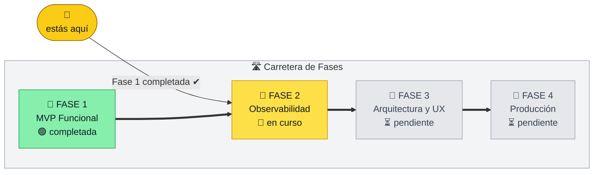

# 🚕 TaxiTech — Taxímetro Digital

> **Taximetro app de 0 a 100.** De la terminal a la flota: un taxímetro 100 % software,
> céntimo a céntimo, construido con DDD en un monorepo uv.


[](https://ia-p1-bcn.github.io/proyecto_1_juanCarlos_escamilla/)


[](https://github.com/astral-sh/ruff)
[](LICENSE)

## 🎬 Demo

> 🎬 **Demo en vídeo — próximamente.** Preparamos una demo del CLI grabada con
> [castkit](https://github.com/deeflect/castkit): descubre el binario, planifica la
> sesión y renderiza un GIF listo para este README.

<!-- Embed real — descomentar al generar el GIF con castkit:


Para regenerarla:
    castkit handoff init apps/cli --json
    castkit plan scaffold --session $SESSION --json
    castkit validate --session $SESSION --script demo.json --json
    castkit execute --session $SESSION --script demo.json --non-interactive \
      --preset polished --format gif --output docs/assets/demo-taximetro.gif
-->

## ✨ Características

- ⌨️ **CLI en tiempo real** — inicia la Carrera con un comando, cambia entre `parada` y
  `en_movimiento`, cobra el Importe exacto con dos decimales; REPL de comandos y TUI a
  pantalla completa *(Fase 1 — 🟢)*
- 🧾 **Histórico y observabilidad** — cada carrera queda registrada en disco; logs
  estructurados; tarifas configurables sin redeployar *(Fase 2)*
- 🔐 **Arquitectura y UX** — refactorización OO, acceso por contraseña segura, GUI para
  tablet con botones grandes *(Fase 3)*
- 🌐 **Producción** — histórico en base de datos, API REST, panel web y despliegue con un
  solo comando *(Fase 4)*

## 🗺️ Roadmap — la carretera del proyecto


```mermaid
flowchart LR
    TAXI(["🚕<br/>estás aquí"]) -- Fase 1 completada ✔ --> F2
    subgraph CARRETERA["🛣️  Carretera de Fases"]
        direction LR
        F1["🚩 FASE 1<br/>MVP Funcional<br/>🟢 completada"] ==> F2["🚩 FASE 2<br/>Observabilidad<br/>🔧 en curso"] ==> F3["🚩 FASE 3<br/>Arquitectura y UX<br/>⏳ pendiente"] ==> F4["🚩 FASE 4<br/>Producción<br/>⏳ pendiente"]
    end
    style TAXI fill:#facc15,stroke:#a16207,color:#111827
    style CARRETERA fill:#f3f4f6,stroke:#9ca3af
    style F1 fill:#86efac,stroke:#16a34a,color:#111827
    style F2 fill:#fde047,stroke:#ca8a04,color:#111827
    style F3 fill:#e5e7eb,stroke:#9ca3af,color:#374151
    style F4 fill:#e5e7eb,stroke:#9ca3af,color:#374151
```

🟢 completada · 🟡 en curso · ⚪ pendiente — **el 🚕 avanza al cerrar cada Fase**.

Cada Fase es un milestone con sus historias: [`Fase 1`](https://github.com/IA-P1-BCN/proyecto_1_juanCarlos_escamilla/milestone/1) · [`Fase 2`](https://github.com/IA-P1-BCN/proyecto_1_juanCarlos_escamilla/milestone/2) · [`Fase 3`](https://github.com/IA-P1-BCN/proyecto_1_juanCarlos_escamilla/milestone/3) · [`Fase 4`](https://github.com/IA-P1-BCN/proyecto_1_juanCarlos_escamilla/milestone/4)

## 🛠️ Instalación

Requisitos: Python 3.12+, [uv](https://docs.astral.sh/uv/) y
[Task](https://taskfile.dev) (`brew install go-task`; [otras formas de
instalarlo](https://taskfile.dev/installation/)).

```bash
git clone git@github.com:IA-P1-BCN/proyecto_1_juanCarlos_escamilla.git
cd proyecto_1_juanCarlos_escamilla
task setup        # uv sync --all-packages + hooks de pre-commit
```

> ¿Sin `task`? Fallback directo: `uv sync --all-packages && uv run pre-commit install`.

## 🧰 Comandos del día a día

| qué quieres | con task | con uv (fallback) |
| --- | --- | --- |
| arrancar el REPL | `task run` | `uv run taximetro-cli` |
| arrancar la TUI | `task tui` | `uv run taximetro-tui` |
| formatear | `task format` | `uv run ruff format .` |
| lint | `task lint` | `uv run ruff check .` |
| tipos | `task typecheck` | `uv run mypy` |
| tests | `task test` | `uv run pytest` |
| todo lo que exige la CI | `task check` | los cuatro anteriores |

## 🚦 Uso

### REPL de comandos — `task run`

La línea de estado está siempre visible y se refresca sola cada segundo; tras
`finalizar` puedes encadenar otra Carrera sin cerrar el programa:

```text
$ task run
🚕 TaxiTech — Taxímetro Digital
Bienvenido. Comandos: iniciar · estado parada|movimiento · finalizar · salir
🚕 libre · sin carrera
> iniciar
Carrera iniciada — el contador corre en parada (0,02 €/s)
🚕 parada · 0,00 €
> estado movimiento
🚕 en_movimiento · 0,06 €
> finalizar
Carrera finalizada. Importe total: 0,26 €
🚕 libre · sin carrera
> salir
```

Opciones con `task run -- --help` (equivale a `uv run taximetro-cli --help`).

### TUI a pantalla completa — `task tui`

El puesto del conductor: contador grande que corre en tiempo real, badge de Estado
(`🅿️ PARADA` / `🚕 EN_MOVIMIENTO`) y avisos al finalizar.

| tecla | acción |
| --- | --- |
| `1` | Iniciar carrera |
| `2` | Cambiar estado (parada ↔ en_movimiento) |
| `3` | Finalizar — muestra el Importe total |
| `q` | Salir |

## 🧭 Cómo está construido

Monorepo uv minimalista: **toda la lógica de negocio en `packages/taximetro`** (capas
DDD: `domain/` — Carrera por tramos, Tarifa, Money, eventos; `application/` — el caso
de uso del turno con reloj inyectado; `infrastructure/` — config y EventBus) y **la
presentación en `apps/taximetro_cli`** (REPL Typer + TUI Textual, textos en
`textos.json`). El Importe se deriva de los tramos con un único redondeo; las tarifas
viven en `packages/taximetro/config/tarifas.json`.

- 📘 Arquitectura: [`docs/agents/architecture.md`](docs/agents/architecture.md)
- 🗣️ Lenguaje del dominio: [`CONTEXT.md`](CONTEXT.md)
- 🧾 Decisiones: [`docs/adr/`](docs/adr/)

## 🤝 Contribuir

1. Rama de trabajo desde `dev`: `git checkout -b feat/mi-cambio dev`
2. PR hacia `dev` con título semántico (`feat: …`, `fix: …`) — la CI ejecuta
   ruff + mypy + pytest.
3. TDD estricto: primero el test en rojo (`docs/agents/testing-tdd.md`).

Tras `task setup`, cada commit pasa por pre-commit (ruff lint + formato y checks
de higiene de ficheros).

**Checklist del README en cada PR:** si cerraste una Fase, **mueve el 🚕** al siguiente
tramo del diagrama y pon su banner en 🟢.

## 📄 Licencia

[Distribuido bajo la licencia MIT](LICENSE).
